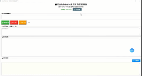
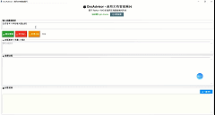
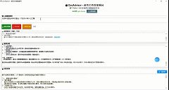

# DocAdvisor 🚀

> 基于 ReAct + RAG 的智能文档顾问系统，让 AI 帮你检索文档并生成专业方案

[](https://www.python.org/)
[](LICENSE)

## ✨ 特性

- 🤖 **ReAct 循环推理** - Agent 自动检索文档并生成方案
- 🔧 **结构化工具调用** - 支持 LLM 原生的 tool_calls，更稳定可靠（自动降级到文本匹配）
- 📚 **知识库检索** - 基于本地文档库生成专业建议
- 🎨 **双界面支持** - 命令行和图形界面两种使用方式
- 🔄 **多轮对话** - 支持连续对话，保持上下文记忆
- ⚙️ **多模型支持** - 支持智谱AI、OpenAI、Claude、通义千问、Gemini

## 🚀 快速开始

### 安装

```bash
git clone https://github.com/Ing-la/DocAdvisor.git
cd DocAdvisor
pip install -r requirements.txt
```

### 配置

1. **复制配置文件**：
   ```bash
   cp .env.example .env
   ```

2. **配置 API Key**（两种方式任选其一）：
   
   **方式一：GUI 界面配置（推荐）**
   - 运行 `python scripts/tkinter_app.py`
   - 如果未配置，会自动弹出提示
   - 点击"⚙️ 模型配置"按钮，输入你的 API Key 和选择模型
   
   
   
   **方式二：手动编辑**
   - 编辑 `.env` 文件，填入你的 API Key：
     ```env
     API_KEY=your_api_key_here
     MODEL=glm-4-flash
     PROVIDER=zhipu
     ```

### 运行

**GUI 版本（推荐）**：
```bash
python scripts/tkinter_app.py
```

**命令行版本**：
```bash
python scripts/main.py
```

## 💡 使用示例

输入你的需求，Agent 会自动检索相关文档并生成专业方案：

```
设计一款ESG可持续投资基金的销售策略
```

Agent 会：
1. 分析你的需求
2. 检索相关文档
3. 生成结构化方案

### 演示效果





## 🏗️ 技术架构

- **ReAct 框架** - Reasoning + Acting 循环推理
- **结构化工具调用** - 优先使用 LLM 原生的 tool_calls API，自动降级到文本匹配（兼容旧模型）
- **RAG 检索** - 基于关键词的文档检索
- **多模型支持** - 支持 5+ 大模型服务提供商
- **YAML 配置** - 流程配置驱动，易于扩展

### 🔧 工具调用机制

本项目支持两种工具调用方式：

1. **现代方式（优先）**：使用 LLM 原生的 `tool_calls` API
   - 更稳定：无需文本解析，减少格式错误
   - 更简洁：模型原生支持，无需复杂的 prompt 设计
   - 更灵活：支持多工具并行调用

2. **降级方式（兼容）**：使用正则表达式提取 Action
   - 兼容不支持 tool_calls 的旧模型
   - 自动检测并切换，无需手动配置

系统会自动检测模型响应格式，优先使用 tool_calls，如果不支持则自动降级到文本匹配。

## 📖 详细文档

查看 [docs/README.md](docs/README.md) 了解完整文档和使用说明。

## 🤝 贡献

欢迎提交 Issue 和 Pull Request！

## 📄 许可证

本项目采用 MIT 许可证，详见 [LICENSE](LICENSE) 文件。

---

**⭐ 如果这个项目对你有帮助，欢迎 Star！**
